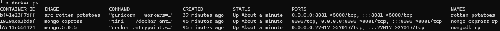
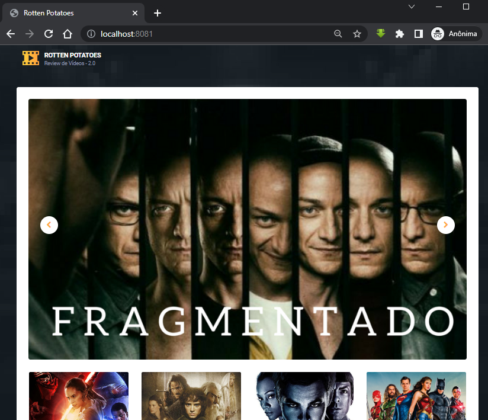

# Desafio Docker KebDev

#### Build e Exec da aplicação rotten-potatoes.

> **Nota:** Criar o arquivo Dockerfile doretório SRC do projeto.

Apos criar o arquivo abra o mesmo e add as linhas abaixo para build da imagem:

```
FROM python:3.8.13-slim-buster
LABEL MAINTAINER = "Anderson Amaral - INICIATIVA KUBERNETES"

WORKDIR /app
COPY requirements.txt .
RUN python -m pip install -r requirements.txt
COPY . /app

EXPOSE 5000
CMD ["gunicorn", "--workers=3", "--bind", "0.0.0.0:5000", "-c","config.py", "app:app"]
```

Salve e feche o mesmo. 

Agora crie um **docker-compose.yml**, no compose vamos usar variáveis para facilitar concentrar a edição em um lugar, as declarações ficam no arquivo **.env** localizado dentro de *SRC*.

A primeira parte do compose é referente a aplicação, onde tem a declaração do Service, o build do Dockerfile, Nome do Conteiner e Aplicação, Portas, Rede e Variáveis de Banco (MongoDB).
```
version: '3.8'

# Deployment da app web Rotten Potatoes
services:
  rotten-potatoes:
    build:
      dockerfile: Dockerfile
      context: ./
    privileged: true
    restart: always
    container_name: ${CONTAINER_NAME}
    hostname: ${APP_NAME}
    ports:
      - ${PORT_LOCAL_CONTAINER}:${PORT_APP}
    expose:
      - ${PORT_APP}
    networks:
      - ${NETWORK}
    depends_on:
      - ${DEPENDS}
    environment:
      MONGODB_HOST: ${MGDB_HOST}
      MONGODB_USERNAME: ${MGDB_USERNAME}
      MONGODB_PASSWORD: ${MGDB_PASSWORD}
      MONGODB_PORT: ${MGDB_PORT}
      MONGODB_DB: ${MGDB_DB}
```
Na segunda parte do arquivo vamos criar o deploy MongoDB
```
# Deployment do MongoDB
  mongodb-rp:
    image: mongo:5.0.5
    container_name: ${MGDB_HOST}
    hostname: ${MGDB_HOST}
    expose:
      - ${MGDB_PORT}
    ports:
      - ${MGDB_PORT}:${MGDB_PORT}
    networks:
      - ${NETWORK}
    volumes:
      - mongo_vol:/data/db
    environment:
      MONGO_INITDB_ROOT_USERNAME: ${MGDB_USERNAME}
      MONGO_INITDB_ROOT_PASSWORD: ${MGDB_PASSWORD}
```
Na terceira parte faz referencia a interface grafica do mongoDB o Mongo-Express
```
# Instalação e configuração da interface do Mongo-Express para gerenciamento do banco via console web.
  mongodb-express-rp:
    image: mongo-express
    restart: always
    container_name: ${EX_CONTAINER_NAME}
    hostname: ${EX_HOST_NAME}
    expose:
      - ${PORT_LOCAL_EXPRESS}
    ports:
      - ${PORT_LOCAL_EXPRESS}:${PORT_LOCAL_CONTAINER}
    networks:
      - ${NETWORK}
    depends_on:
      - ${DEPENDS}
    environment:
      ME_CONFIG_MONGODB_SERVER: ${MGDB_HOST}
      ME_CONFIG_MONGODB_ADMINUSERNAME: ${MGDB_USERNAME}
      ME_CONFIG_MONGODB_ADMINPASSWORD: ${MGDB_PASSWORD}
      ME_CONFIG_MONGODB_PORT: ${MGDB_PORT}
```
E no final do arquivo temos a declaração de persistência de disco e rede.
```
volumes:
  mongo_vol:

networks:
  mongo-net-rt:
    driver: bridge
```
> **Nota:** Favor add uma senha no arquivo localizado em **src/.env** na variável **MGDB_PASSWORD=** pois a mesma está em branco.

E execute o comando **docker-compose up -d** dentro do diretório da aplicação.

Terá uma saída igual a abaixo:



Após a execução da imagem **andersontarj/conversaotemperatura** abra o navegador de sua preferencia e digite <http://localhost:8081>

Se tudo estiver correto você vera no navegador a tela igual a que está abaixo:


